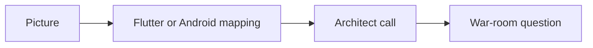

# How to read this book

> **Mental model.** A mobile architect does not collect facts. They collect pictures they can redraw under pressure.

This is not a PDF and not a docs site. It is a field book: open it on a laptop as two pages, or on a phone as one page you swipe.

## The picture

Every lesson uses the same walk:

1. A picture (usually mermaid).
2. How it actually works, in short sentences.
3. “You already know this in Flutter as…”
4. The call you would make in a design review.
5. The anti-pattern that looks smart and fails in production.
6. A war-room question you should be able to answer out loud.

<!-- pagebreak -->

## How it actually works

Read the picture until you can redraw it from memory. Only then read the prose. If you cannot redraw it, you do not own it yet.

Skim the four-platform strip even on topics you think you know. The point is the *mapping*, not the definition.

Leave the cheatsheet for the night before a review. It is the page you would want on the table.

## You already know this in Flutter as…

You already skip widget tutorials. Treat BLoC, isolates, and `pubspec` the same way this book treats UIKit and Hermes: as *placements* on a shared map.

## Architect call

If a chapter does not change a decision you would make next week, you read it too passively. Write one sentence in the margin: “So I will / will not …”

## Anti-patterns

- Highlighting every sentence.
- Collecting acronyms (VIPER, TCA, JSI) without a picture.
- Reading Android chapters as “I already know this” and skipping the iOS column.

## War-room question

A staff engineer asks: “Explain Clean Architecture without saying the word Clean.” What picture do you draw?

## Cheatsheet

- Picture → mapping → decision.
- Laptop: two pages. Phone: swipe.
- Last page is remembered. Ribbon saves a place.
- Arrow keys, tap the edges, or swipe.
