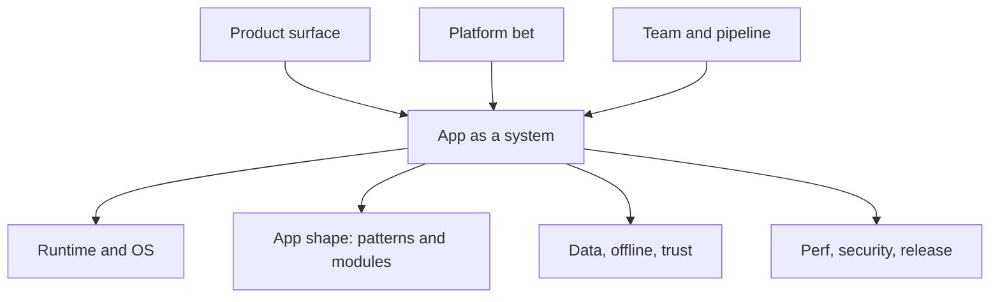

# The mobile architect map

> **Mental model.** Architecture is the set of decisions that are expensive to reverse.

A mobile architect owns more than folders. They own the product surface, the platform bet, and the way the team ships.

## The picture

Three rings:

- **Product** — what the user can do when the radio dies, the store rejects you, or the OS kills the process.
- **Platform** — native, Flutter, RN, KMP: a hiring and constraint choice, not a taste choice.
- **Org** — modules, CI, ownership, who can ship on Friday.

<!-- pagebreak -->

## How it actually works

This book walks the map in order:

| Ring | Volume | What you gain |
| --- | --- | --- |
| Craft | 1 | OOP, SOLID, MVVM/Clean, runtimes |
| OS | 2 | Sandbox, lifecycle, permissions |
| Gaps | 3–4 | iOS and React Native, deeply |
| Home turf | 5–6 | Android and Flutter as *architect* upgrades |
| Bet | 7 | Which stack, honestly |
| Domains | 8 | Data, UI systems, perf, security, delivery, org |
| Studio | 9–10 | Full designs and what is new now |

## You already know this in Flutter as…

You already make product calls (“this is a package, that is add-to-app”). The missing muscle is making the *same* call when the stack is UIKit or the New Architecture.

## Architect call

If you cannot point to the ring you are deciding (product, platform, or org), you are bikeshedding a folder name.

## Anti-patterns

- Treating “architect” as “the person who draws Clean circles.”
- Optimizing widgets while the store versioning story is undefined.
- Picking Flutter vs RN after the team is hired, not before.

## War-room question

“We need iOS parity in four months. Do we hire Swift, stretch Flutter, or stand up RN?” Which ring answers first?

## Cheatsheet

- Expensive-to-reverse = architecture.
- Three rings: product, platform, org.
- This volume is the shared language. Later volumes are the platforms and the studio.
