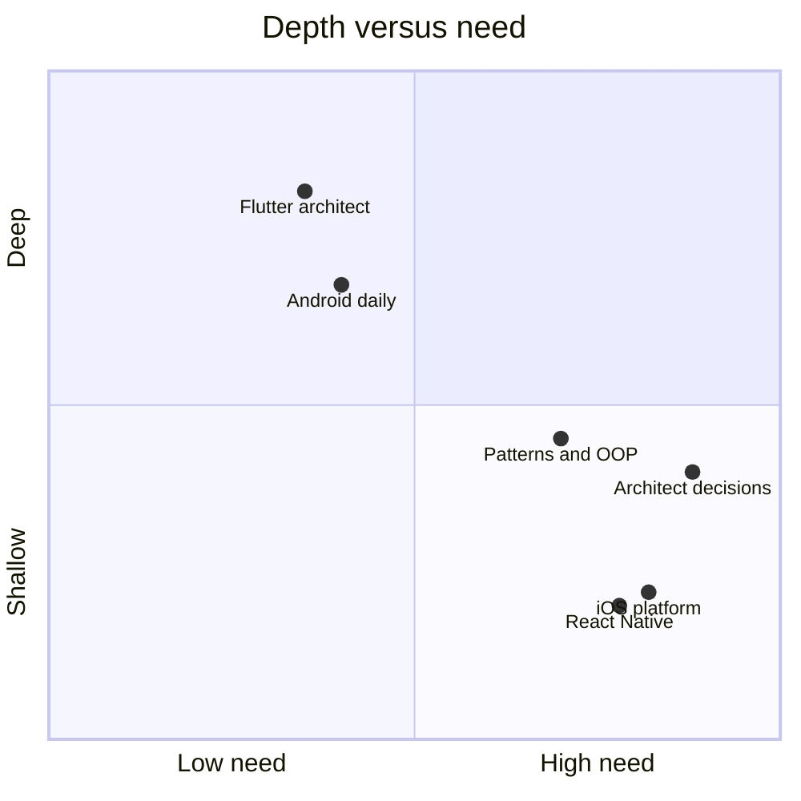

# Your gap profile

> **Mental model.** You are not a beginner. You are uneven — and that is a better starting point than a blank slate.

This book is cut for one person: strong Flutter, good Android, basic iOS, basic React Native.

## The picture

The high-need, still-shallow boxes are iOS, React Native, and the decision layer. Volume 1 builds the language. Volumes 3 and 4 fill the platforms.

<!-- pagebreak -->

## How it actually works

| Surface | You today | This book |
| --- | --- | --- |
| Flutter | Ship features, packages, state | Engine, add-to-app, org-scale later |
| Android | Activities, ViewModels, Gradle enough to ship | Process, modules, OEM, Play as architecture |
| iOS | Basic | Full track: Swift, UIKit/SwiftUI, signing, modules |
| RN | Basic | Bridge vs JSI, Hermes, brownfield |
| Patterns | Use BLoC / Provider daily | Name them in Android/iOS/RN and defend a pick |

## You already know this in Flutter as…

BLoC is unidirectional flow. `repository` + `cubit` is already Clean-ish. You do not need another BLoC tutorial. You need the iOS and RN *translations*.

## Architect call

When you feel bored in a Flutter-shaped paragraph, read the iOS column twice. That is the work.

## Anti-patterns

- Re-reading Flutter state-management blogs instead of UIKit lifecycle.
- Pretending RN is “Flutter with JS.” The runtime is the difference.
- Skipping OOP/SOLID because you already write classes. The vocabulary is for reviews, not for syntax.

## War-room question

A director says you are “the Flutter person.” How do you answer so they start sending you *platform* decisions?

## Cheatsheet

- Uneven on purpose: skip widget 101.
- Invest in iOS and RN early after this volume.
- Translate, do not relearn what you already ship.
