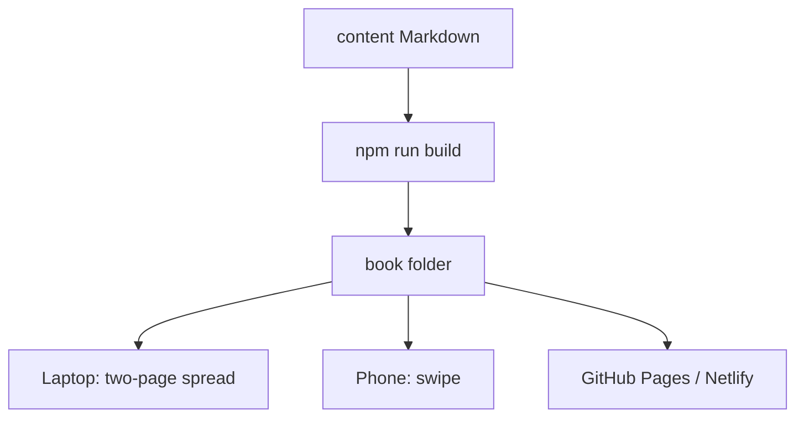

# Open the book

> **Mental model.** Same pages, two bodies: a desk spread on a laptop, a single leaf on a phone.

## The picture

## How it actually works

From the repo root:

1. `npm run book` — builds pages and serves them (default [http://localhost:4173](http://localhost:4173)).
2. `npm run build` — only rebuilds `book/js/pages.js` after you edit Markdown.
3. Hosting — upload the `book/` folder to any static host. It is HTML, CSS, JS, and images. No server API.

On a laptop, you see two pages and a gutter. Arrow keys or the page edges turn the leaf. On a phone, one page; swipe.

The book remembers the last page. **Ribbon** pins a place.

<!-- pagebreak -->

| Surface | What you do |
| --- | --- |
| Cursor | Edit `content/**/*.md` — this is the source of truth |
| Browser | Read `book/` like paper |
| Later chat | Say **write volume 2** — the agent reads `CURRICULUM.md` |

## You already know this in Flutter as…

`lib/` is source, `build/` is output. Here `content/` is `lib/`, `book/` is `build/`.

## Architect call

Study in the book, not in a PDF export. Search and the ribbon exist so the page-turn is not a toy.

## Anti-patterns

- Editing HTML inside `book/` by hand. It will be overwritten.
- Opening raw Markdown and skipping diagrams.
- Expecting `file://` plus a network CDN. Vendors are local; still prefer `npm run book` or a host.

## War-room question

A new hire has only a phone. How do they read the same chapter you have open on a monitor?

## Cheatsheet

- `npm run book` to read.
- `content/` in, `book/` out.
- After Volume 1: say **write volume 2**.
