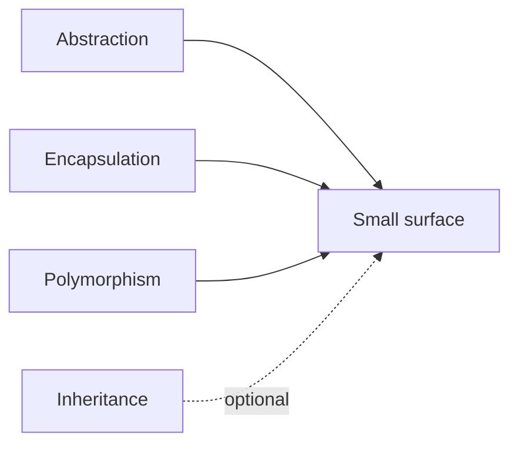

# The four pillars — and the fifth

> **Mental model.** OOP is not “use classes.” It is a way to hide change behind a small surface.

## The picture

The four school names: abstraction, encapsulation, inheritance, polymorphism. Architects treat inheritance as optional and **composition** as the default fifth.

## How it actually works

- **Abstraction** — the caller knows *what*, not *how*. `PaymentClient.charge` hides Stripe vs Play Billing.
- **Encapsulation** — invariants live with the data. A `Money` type that refuses a negative amount.
- **Polymorphism** — one shape, many implementations. `AuthRepository` is Firebase today, a fake in tests.
- **Inheritance** — share implementation by “is-a.” Useful for UI kits. Dangerous for domain models.

<!-- pagebreak -->

| Pillar | Android | iOS | Flutter | RN |
| --- | --- | --- | --- | --- |
| Abstraction | `interface` / `fun interface` | `protocol` | `abstract class` / `interface` | `interface` / duck typing |
| Encapsulation | visibility + backing fields | `private` / access control | `_private` + packages | closures + modules |
| Polymorphism | interfaces, sealed | protocols, existentials | implements / overrides | structural + generics |
| Inheritance | classes, rarely deep | classes, rare in SwiftUI | `extends` widgets | `class` components (legacy) |

## You already know this in Flutter as…

`Widget` inheritance is a framework rule. Your *domain* should not look like a widget tree of subclasses.

## Architect call

If a new payment vendor requires editing five screens, encapsulation failed. If it requires a new `PaymentClient` implementation, it worked.

## Anti-patterns

- A 12-level `BaseActivity` / `BaseViewModel` / `BaseBloc`.
- Getters and setters on every field and calling it encapsulation.
- Using inheritance to share three lines of logging.

## War-room question

“Why is inheritance taught first if we keep telling seniors to avoid it?”

## Cheatsheet

- Surface small. Hide change.
- Inheritance is a privilege, not a default.
- Polymorphism through interfaces/protocols, not deep trees.
