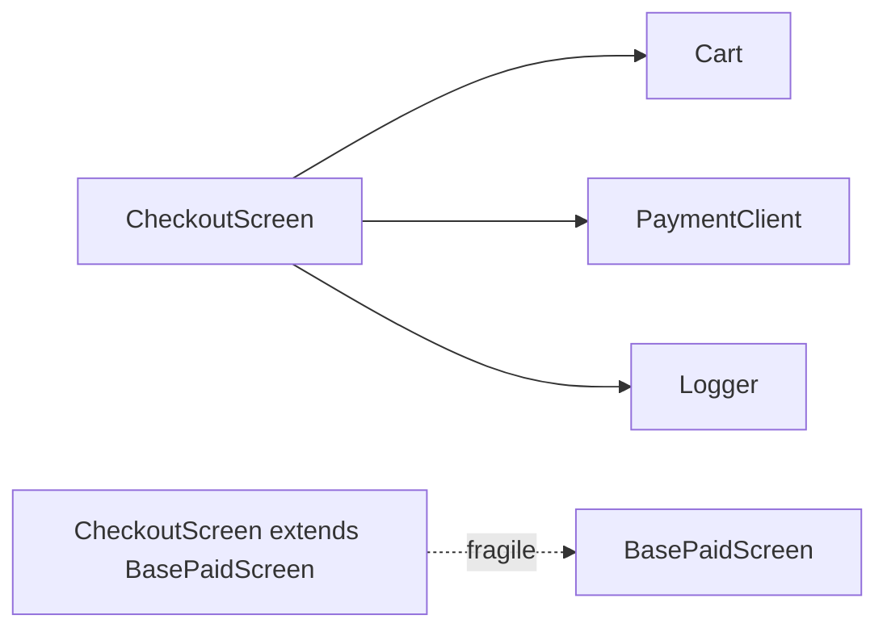

# Composition over inheritance

> **Mental model.** “Has-a” ages better than “is-a.”

## The picture

The left graph still works when payments grow a wallet. The right graph breaks when `BasePaidScreen` grows a coupon the checkout does not want.

## How it actually works

**Is-a** means every invariant of the parent is yours. A `Square` that *is-a* `Rectangle` lies the moment someone sets width independently.

**Has-a** means you hold a collaborator. A `Checkout` *has a* `PaymentClient`. Tomorrow it can have two.

Inheritance still wins inside frameworks: `StatelessWidget`, `UIViewController`, `ComponentActivity`. That is their extension point. Your *domain* should not copy that habit.

<!-- pagebreak -->

| Choice | Use when | Avoid when |
| --- | --- | --- |
| Inheritance | Framework says so; true subtype | Sharing helpers; optional behavior |
| Composition | Features combine independently | You want one object to “be” the other |
| Delegation | Kotlin `by`, Swift wrappers | You re-implement a 40-method interface by hand |

## You already know this in Flutter as…

A `Column` *has* children. It does not *extend* them. Your `OrderRepository` should *have* a `HttpClient` and a `OrderCache`, not extend `BaseRepository`.

## Architect call

In review: if the only reason for `extends` is “reuse `showLoading()`,” extract a function or a small collaborator.

## Anti-patterns

- `BaseViewModel` with 30 protected methods.
- Deep widget subclasses (`MyBasePage` → `MyFormPage` → `MyCheckoutPage`).
- Fixing a parent bug and breaking six children.

## War-room question

“We need a guest checkout and a wallet checkout. Inheritance tree or two compositions on one screen?”

## Cheatsheet

- Has-a for features. Is-a only for real subtypes and framework hooks.
- Delegation is composition with manners.
- If you override half the parent, you picked the wrong parent.
