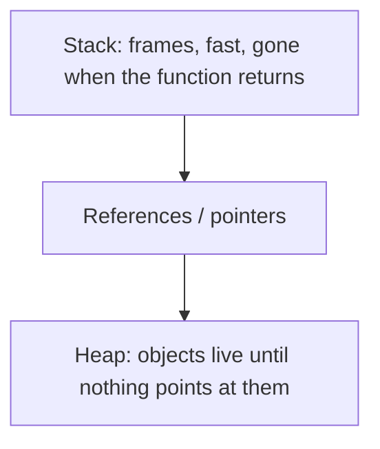

# Value, reference, stack, heap

> **Mental model.** Identity is “same box.” Equality is “same contents.” Memory is “who owns the box.”

## The picture

You do not need a GC PhD. You need to know why a copied `User` did not update the profile header.

## How it actually works

**Value types** copy contents (`struct` in Swift, `data class` copy in Kotlin, Dart records / immutable classes). **Reference types** copy the arrow (`class` almost everywhere).

**Equality** (`==`) should mean business equality. **Identity** (`===`, `identical`) means the same allocation.

**Stack** holds frames and small values. **Heap** holds objects. GC (ART, Dart, Hermes) and ARC (Swift) both free heap — they just argue about *when*.

<!-- pagebreak -->

| Topic | Android | iOS | Flutter | RN |
| --- | --- | --- | --- | --- |
| Default objects | References on the heap | `class` ref, `struct` value | Instances on the heap | JS objects are refs |
| Copy | `copy()` / data class | `struct` assign copies | immutable + `copyWith` | spread `{...obj}` |
| Identity | `===` | `===` / `ObjectIdentifier` | `identical` | `===` |
| Freeing | GC | ARC | GC | GC (Hermes) |

Crossing a thread or isolate *copies* (or requires `Send` / `@Sendable`). That is why a Flutter isolate cannot share a random class instance.

## You already know this in Flutter as…

`const` widgets and immutable state exist so identity stays stable and rebuilds stay cheap. Mutating a list in a Cubit state is the same bug as mutating a Swift `class` you thought was a value.

## Architect call

Domain models that cross layers should be immutable values. UI controllers can be long-lived references.

## Anti-patterns

- Mutating a shared `User` from two screens.
- Using identity to compare `data class` / `Equatable` objects in tests.
- Assuming Swift `struct` is “free.” Large structs copy.

## War-room question

“The badge count updates on profile but not on home. Value copy or two references to different objects?”

## Cheatsheet

- Value = copy contents. Reference = copy the arrow.
- `==` vs identity: know which one you mean.
- Stack is short. Heap is shared. Crossing isolates copies.
