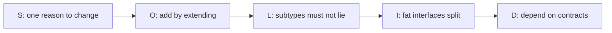

# SOLID — five pages in one

> **Mental model.** SOLID is five ways to keep a change from detonating the app.

## The picture

## How it actually works

**S — Single responsibility.** A class has one reason to change. `LoginViewModel` should not also write analytics CSV. Mobile example: a screen that fetches, maps, caches, and navigates. Split it.

**O — Open/closed.** Add a new `PaymentMethod` without editing the `switch` in five files. Sealed types + one mapper beat a growing `if`.

**L — Liskov.** A `CachedRepo` that *is-a* `Repo` must not throw “offline” where the parent promised “always returns.” Prefer composition if you cannot honor the contract.

<!-- pagebreak -->

**I — Interface segregation.** Do not force a widget to implement `onPay`, `onRefund`, and `onChargeback` if it only shows a receipt. Split protocols.

**D — Dependency inversion.** High-level checkout depends on `PaymentClient`, not `StripeSdk`. The SDK lives behind the contract. This is the SOLID line that *is* Clean Architecture.

| Letter | Anti-pattern you will see Monday |
| --- | --- |
| S | `GodViewModel` / `AppService` |
| O | `when (type)` with 18 payment brands in the UI |
| L | `NotImplementedError` in a subclass |
| I | `BaseCallback` with 20 empty methods |
| D | Screens importing Retrofit / URLSession types |

## You already know this in Flutter as…

A Cubit that imports `dio` is a D violation. A Cubit that imports `AuthRepository` is the inversion done right.

## Architect call

In PR review, name the letter. “This is S, not taste.” People argue taste. They rarely argue a named letter plus an example.

## Anti-patterns

- Folder religion: `domain/` `data/` with a 20-line app and no seams.
- “We are SOLID” because every class has an interface — including `IUser` on a data class.
- Breaking L so a fake can be lazy in tests, then shipping the fake’s contract.

## War-room question

Pick one class from your last PR. Which SOLID letter would you fail first, and what is the smallest fix?

## Cheatsheet

- S: one reason. O: add, don’t edit. L: don’t lie.
- I: small contracts. D: depend upward on abstractions.
- D is the hinge to Clean.
