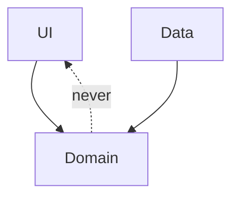

# Coupling, cohesion, dependency direction

> **Mental model.** Cohesion is “these things belong together.” Coupling is “this cannot move without that.” Direction is “who is allowed to know whom.”

## The picture

Arrows point toward stability. Domain does not import Flutter, UIKit, or Retrofit.

## How it actually works

**High cohesion:** a `Cart` module contains cart UI, cart math, and cart tests. You can explain it in one sentence.

**Low coupling:** you can replace the HTTP client without opening the cart math.

**Affinity** is not cohesion. Ten unrelated helpers in `core/utils` are glued by a folder, not by a job.

<!-- pagebreak -->

| Smell | What it really is |
| --- | --- |
| Screen imports database | Coupling through a shortcut |
| `shared` module imported by everything | A coupling magnet |
| Package cycles | Direction was never drawn |
| “Just this once” platform import in domain | Direction leak |

## You already know this in Flutter as…

A feature package that imports `Material` in `domain/` will never run in a pure Dart test. That is coupling you can feel.

## Architect call

Draw the allowed imports before you draw the folders. Folders without a direction rule are costume.

## Anti-patterns

- A `common` module that knows every feature.
- Bidirectional `import` between `checkout` and `profile` “because the avatar is on the receipt.”
- Measuring architecture by number of modules, not by who can change independently.

## War-room question

“If we deleted the profile feature tomorrow, how many modules would fail to compile?” If the answer is “most of them,” coupling won.

## Cheatsheet

- Cohesion up, coupling down, arrows toward the domain.
- Utils is not a module strategy.
- Cycles mean you hid a missing concept (usually a small DTO or a contract).
