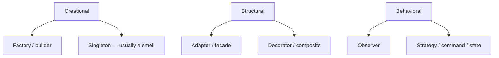

# Design patterns you will actually use

> **Mental model.** A pattern is a named conversation. If you cannot name it, reviewers will argue implementation details forever.

## The picture

Skip the catalog of 23 as a religion. Learn the ones that appear in mobile PRs every week.

## How it actually works

**Factory / builder** — hide messy construction (`URLSession` config, Dio interceptors, a SwiftUI `Environment`). Builders shine when there are eight optional fields.

**Singleton** — “there can be one.” Analytics, and sometimes the database. The smell: hidden global state that tests cannot replace. Prefer a single instance *injected*, not `shared` reached from anywhere.

**Adapter** — wrap a vendor SDK so your domain speaks your types. **Facade** — one door in front of three SDKs. **Decorator** — add logging/retry around a client without editing it. **Composite** — trees (views, menu nodes).

<!-- pagebreak -->

**Observer** — streams, `Flow`, `Combine`, `ChangeNotifier`, Redux subscriptions. The UI *reacts*. Do not re-implement observer with a home-grown callback list unless you must.

**Strategy** — swap an algorithm (`Sort`, `RetryPolicy`, `AuthMethod`). **Command** — undo stacks, analytics events queued as data. **State** — explicit state objects instead of boolean soup.

| Pattern | Android | iOS | Flutter | RN |
| --- | --- | --- | --- | --- |
| Observer | Flow / LiveData | Combine / AsyncSequence | Streams / Listenable | hooks + store |
| Adapter | wrap Play Billing | wrap StoreKit | wrap channel | wrap NativeModule |
| Strategy | interface param | protocol param | typedef / class | function prop |
| Singleton smell | `object` + static | `.shared` | `get_it` without scope | module global |

## You already know this in Flutter as…

`Navigator` is a facade. `Theme` is a decorator of sorts. `Bloc` is observer + state. You already speak patterns; this page names them for mixed teams.

## Architect call

Name the pattern in the PR title when it is the point: “Adapter over StoreKit so domain stays unit-testable.”

## Anti-patterns

- Singleton service locator as the entire architecture.
- Factory that is just a constructor with extra steps.
- Observer spaghetti: five listeners updating each other.

## War-room question

“Is our `AppServices.shared` a facade or a junk drawer?” How would you prove it?

## Cheatsheet

- Creational: factory, builder; singleton only if injected.
- Structural: adapter, facade, decorator, composite.
- Behavioral: observer, strategy, command, state.
