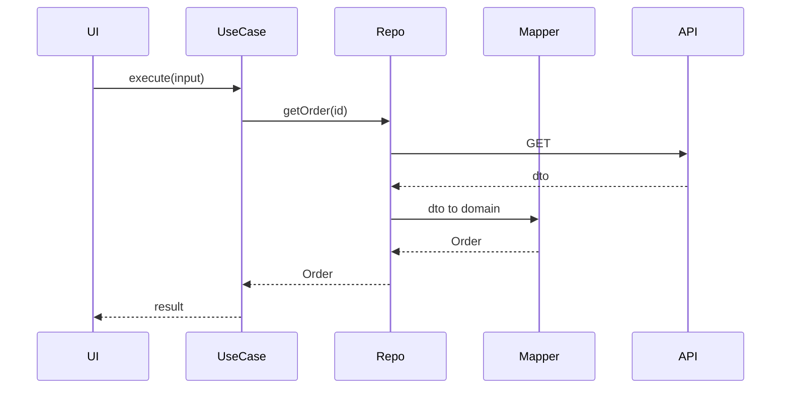

# Repository, use case, mapper, DI

> **Mental model.** These four are how mobile teams *apply* SOLID without saying SOLID.

## The picture

- **Repository** — the app’s door to a kind of data. Hides network + cache.
- **Use case / interactor** — one user job (`PlaceOrder`). Owns the policy.
- **Mapper** — DTO ↔ domain. Stops Retrofit/JSON types from leaking.
- **DI** — construction happens at the edges. The rest receives neighbors.

<!-- pagebreak -->

## How it actually works

A repository is *not* “a class named Repository.” It is a seam: the rest of the app can run on a fake. If the class just forwards one API call and adds nothing (cache, mapping, policy), you paid a name for no seam.

A use case is worth a type when the job has a rule (retry, combine two repos, enforce entitlements). A one-line `repo.get()` does not need a `GetUserUseCase`.

DI is a graph: Hilt / Koin / `get_it` / Swinject / a composition root. The crime is `new Sdk()` in a widget.

| Piece | Android | iOS | Flutter | RN |
| --- | --- | --- | --- | --- |
| Repository | interface + impl | protocol + impl | abstract + impl | interface + impl |
| Use case | class / function | struct / actor | class / function | function |
| Mapper | extension / Mapstruct-ish | init from DTO | `fromJson` isolated | zod + mapper |
| DI | Hilt, Koin | Swinject, factories | get_it, riverpod | context, DI libs |

## You already know this in Flutter as…

`AuthRepository` + a Cubit that calls it *is* this page, if the Cubit does not parse JSON.

## Architect call

Require mappers at the data boundary in the style guide. Everything else is optional ceremony — add use cases when a rule appears, not on day one of a todo app.

## Anti-patterns

- `XxxUseCase` per CRUD verb, each five lines, forever.
- Repository that returns `Response<Dto>` to the UI.
- `GetIt.I<Foo>()` inside a random helper three packages deep.

## War-room question

“Do we need use cases if we have Riverpod / ViewModel / Bloc?” (Yes, when there is a *policy*. No, when they would only forward.)

## Cheatsheet

- Repository = data seam. Use case = policy. Mapper = type firewall.
- DI at the composition root.
- Names without seams are costume.
