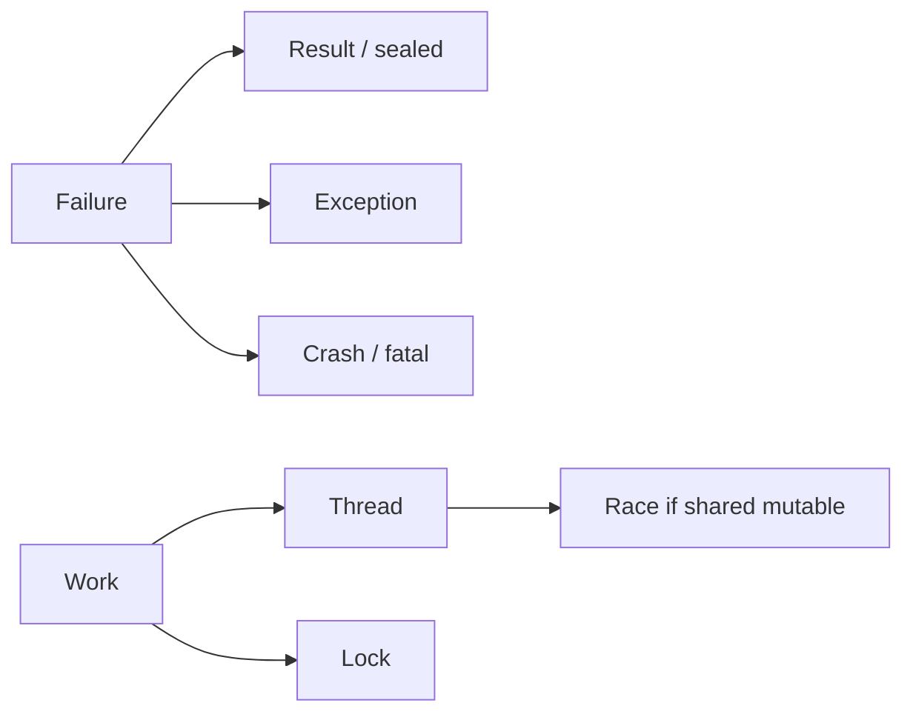

# Errors, results, and concurrency words

> **Mental model.** An error is information. A crash is a broken promise. Concurrency is about *who may touch what, and when*.

## The picture

## How it actually works

**Exceptions** are control flow for *exceptional* paths. Using them for “wrong password” makes call sites noisy and easy to swallow.

**Results** (`Result`, `Either`, Swift `Result`, Dart `Result` / sealed, Kotlin `Result` / sealed) make failure part of the type. The compiler can nag you.

**Crashes** (`fatalError`, force unwrap, Dart `!` on null, RN redbox in prod if you are unlucky) are for broken invariants — not for network.

<!-- pagebreak -->

Concurrency vocabulary, *before* platform APIs:

- **Thread** — an OS worker. The **main / UI thread** paints. Block it and the app janks.
- **Lock** — “only one at a time.” Deadlock is two locks waiting on each other.
- **Race** — two writers, no rule, last write wins (or worse).
- **Async** — “I will continue later.” Not the same as “on another thread.” JS is async on one thread. Dart `async` is often still on the UI isolate.
- **Isolate / process / actor** — memory is *not* shared (or is shared only through messages). Safer, copies cost.

| Word | Android | iOS | Flutter | RN |
| --- | --- | --- | --- | --- |
| Main thread | Main looper | Main actor | UI isolate | JS thread + UI thread |
| Async | coroutines | Swift async | Future / async | Promise / async |
| Parallel work | Dispatchers.IO | Task.detached | Isolate | JSI / native |
| Errors | sealed / Result | Result / throws | Result / throws | Result / throw |

## You already know this in Flutter as…

`Future` is async, not parallel. `compute()` / isolates are parallel. `catchError` that returns `null` is how production mysteries start.

## Architect call

Pick one error type at the domain boundary (`Failure` sealed). Map exceptions at the edge. Never leak `DioException` or `NSError` into UI.

## Anti-patterns

- Empty `catch`.
- `try/catch` around 200 lines “just in case.”
- Doing JSON parse on the UI thread for a 2 MB payload and calling it “a jank mystery.”

## War-room question

“Is this `async` function allowed to touch the UI? How do you know?”

## Cheatsheet

- Result for expected failure. Exception for broken contracts. Crash for invariants.
- Async ≠ parallel. Main thread paints.
- Isolate/actor: share messages, not objects.
