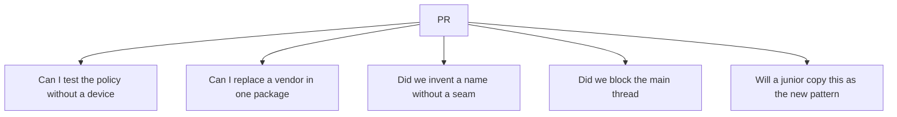

# What clean code means in a review

> **Mental model.** As an architect you review *reversibility*, not punctuation.

## The picture

Syntax nits are cheap. A new global singleton is expensive.

## How it actually works

Ask five questions, in this order:

1. **Direction** — does UI import data types? Stop there.
2. **Seam** — is there a fake for the new SDK?
3. **Name** — does `Manager` / `Helper` / `Service` hide two jobs?
4. **Thread** — any disk, JSON, or crypto on the UI path?
5. **Copy-paste** — if this PR becomes the template, are we happy?

<!-- pagebreak -->

You already write readable Dart. The upgrade is refusing PRs that are readable *and* irreversible.

| Approve | Request changes |
| --- | --- |
| Small adapter over a vendor | Screens talking to Retrofit / URLSession |
| Sealed failures mapped at the edge | `catch (e) {}` |
| Feature package with a public barrel | New code in `common/utils` |
| Immutable state | Mutated lists shared across screens |

## You already know this in Flutter as…

You have rejected `setState` soup. Apply the same allergy to `BaseViewModel` soup and `AppServices.shared`.

## Architect call

Write the rule down once (this book, a CONTRIBUTING, a lint). Do not win the same argument with charisma every Friday.

## Anti-patterns

- Reviewing only the language you like (Dart) and rubber-stamping Kotlin/Swift.
- Blocking a PR for brace style while a cycle lands in `domain`.
- “We’ll refactor after the release” with no ticket and no seam.

## War-room question

A VP wants the feature tomorrow. Which of the five questions are you allowed to waive, and which one never?

## Cheatsheet

- Review reversibility: direction, seam, name, thread, template.
- Readable is necessary, not sufficient.
- Write the rule once. Point at it.
