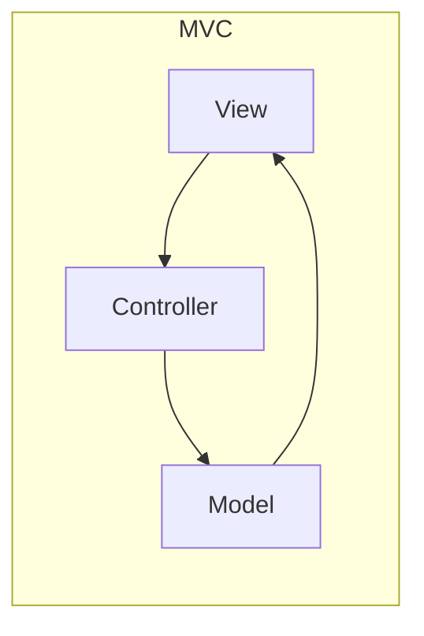
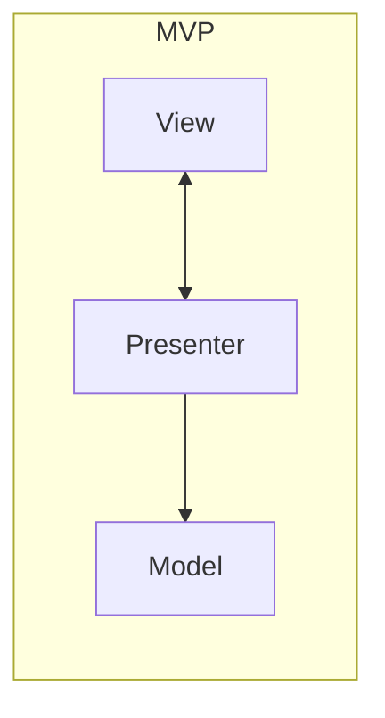
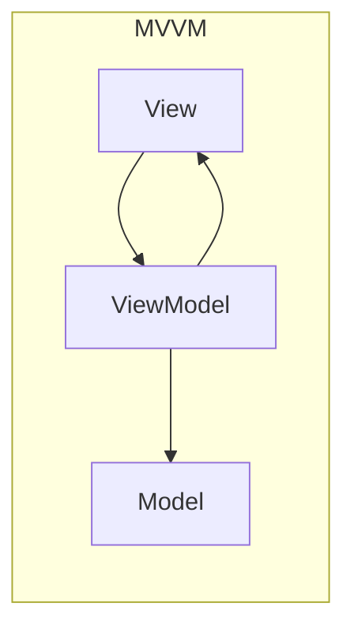

# MVC, MVP, MVVM — one family

> **Mental model.** All three answer “who owns UI state, and who talks to the model?” They differ only in how chatty the view is.

## The picture

## How it actually works

**MVC** — the controller interprets input. The view often observes the model. Classic UIKit and old Android Activities mixed V and C until they hurt.

**MVP** — the presenter is a puppet master. The view is a passive interface (`showName`). Easy to unit-test, verbose, and the presenter tends to become a god.

**MVVM** — the view binds to observable state. The ViewModel does not hold a view reference. Rotation / configuration changes become survivable.

<!-- pagebreak -->

| Pattern | Android | iOS | Flutter | RN |
| --- | --- | --- | --- | --- |
| MVC | Early Activities | UIKit controllers | almost never | class components + store |
| MVP | still in older apps | VIPER-adjacent | rare | container/presenter |
| MVVM | Jetpack VM + state | SwiftUI + Observable | something else* | hooks + state |

\*Flutter “MVVM” is usually a ChangeNotifier or a Cubit. The *idea* matches: view binds, logic does not point at widgets.

## You already know this in Flutter as…

`Cubit` + `BlocBuilder` is MVVM with a stricter input (`event` / `emit`) if you use Bloc. Provider + `notifyListeners` is MVVM with more rope.

## Architect call

For a new native Android/iOS screen in 2026: MVVM (or MVI). Do not start a new MVP unless the team already has a hundred presenters and a generator.

## Anti-patterns

- Calling it MVVM while the ViewModel holds `Context` / `UIViewController`.
- MVC where the Activity is 2,000 lines of everything.
- MVP interfaces that repeat every `TextView` setter.

## War-room question

“If I rotate the phone, who still has the typed text — View, Presenter, or ViewModel — and why?”

## Cheatsheet

- MVC: controller + leaky views. MVP: passive view, chatty presenter. MVVM: bind to state, no view pointer.
- New work: MVVM / MVI.
- Flutter Bloc ≈ MVVM + events.
