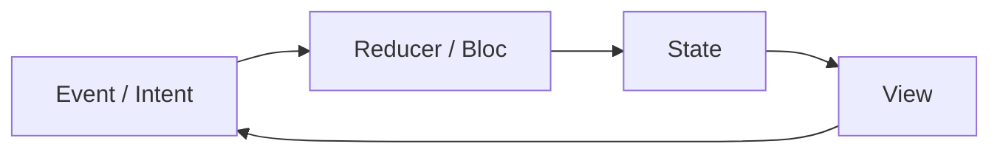

# MVI and unidirectional flow

> **Mental model.** State is a value. Events go in. A new state comes out. Time travel is a log of those pairs.

## The picture

No second door. The view does not poke `user.name =`. It sends `NameChanged`.

## How it actually works

**MVI** (Model-View-Intent) is MVC’s grandchild via Redux. One immutable state. A pure-ish reducer. Side effects live beside the reducer, not inside the view.

This is why Flutter Bloc, Redux, TCA, and Android UDF look like cousins. They disagree about syntax, not about the arrow.

<!-- pagebreak -->

**State** must be enough to draw the screen. If the view must “remember” a dialog, it is not in the state.

**Intents** are facts about the user or the system (`SubmitTapped`, `TokenExpired`). They are not “setLoading(true).”

**Effects** (`Channel`, `once` events, TCA effects) are for navigation and toasts — things that are not *state*, they are *moments*.

| Stack | Event in | State out |
| --- | --- | --- |
| Flutter Bloc | `add(Event)` | `state` |
| Android UDF | `onEvent` | `StateFlow` |
| TCA | `Action` | `State` + `Effect` |
| Redux / RN | `dispatch` | store |

## You already know this in Flutter as…

If you have ever replayed Bloc events in a test, you already trust unidirectional flow. MVI is that trust, named.

## Architect call

Use MVI when the screen has more than three states (loading / error / data) or when QA needs “what did the user do.” Skip it for a static settings row.

## Anti-patterns

- Mutable state objects inside a “reducer.”
- Two stores updating each other (a cycle of arrows).
- Putting navigation in the reducer as a boolean `shouldOpenDetails` that never resets.

## War-room question

“Show me how you would reproduce a production bug from an event log.” If they cannot, the flow is not unidirectional yet.

## Cheatsheet

- Event in, state out, one arrow.
- State draws. Effects are moments.
- Bloc / UDF / TCA / Redux are dialects.
