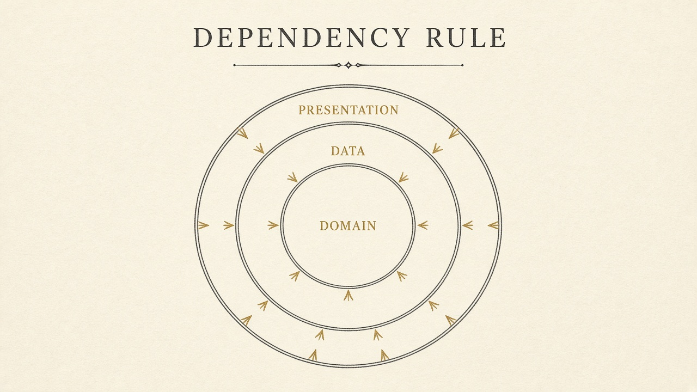
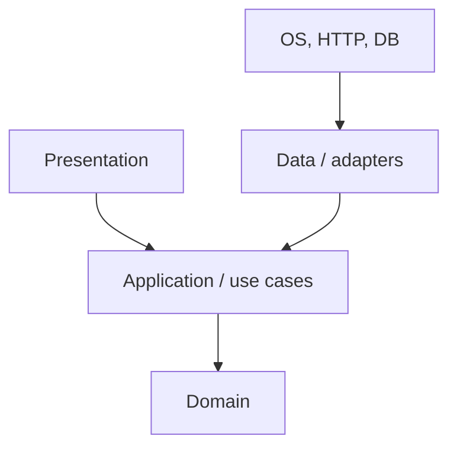

# Clean and hexagonal

> **Mental model.** Policies do not import mechanisms. The domain does not know Flutter exists.

## The picture

**Hexagonal** (ports and adapters): the app is a hexagon. **Ports** are interfaces. **Adapters** are Firebase, Room, URLSession. The hexagon does not mention them.

**Clean** (Martin) is the same dependency rule drawn as circles. Entities at the center. Frameworks at the edge.

<!-- pagebreak -->

## How it actually works

The **dependency rule**: source code dependencies point inward. A use case may import an `Order` entity. An entity may not import a use case. A use case may not import Dio.

**Layers are not folders.** You can have Clean in three files. You can have `domain/` `data/` `presentation/` and still import `BuildContext` in an entity.

Use Clean when you have *real* vendor risk (payments, identity, offline sync) or multiple UIs (phone + watch). Do not install five layers for a marketing app with three screens.

| Layer | Allowed to know | Forbidden |
| --- | --- | --- |
| Domain | your types | Flutter, Retrofit, Room |
| Application | domain + ports | widgets, JSON |
| Data | ports + SDKs | widgets |
| Presentation | app API + widgets | SQL, raw DTO |

## You already know this in Flutter as…

A package whose `lib/src/domain` is pure Dart, with `flutter` only in `presentation`. That *is* hexagonal.

## Architect call

Clean is a **direction**, not a folder religion. Require the rule. Do not require `usecases/get_user_usecase.dart` for every read.

## Anti-patterns

- 15 files to show a name.
- Domain models that are JSON-serializable “for convenience.”
- Calling it Clean because the repo has the three folder names.

## War-room question

“Point at a type that would still compile if we deleted Flutter. If you cannot, we do not have a domain — we have a UI.”

## Cheatsheet

- Arrows inward. Domain is ignorant.
- Ports = interfaces. Adapters = vendors.
- Direction over folders. Ceremony is optional.
