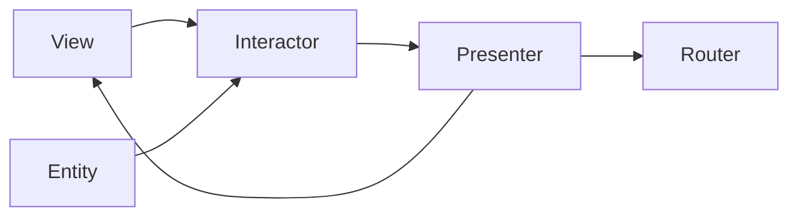

# VIPER and coordinators

> **Mental model.** VIPER is MVP exploded so navigation and assembly have names. Coordinators steal the navigation part and leave the rest alone.

## The picture

Five nouns: View, Interactor, Presenter, Entity, Router. Plus a builder that wires them.

## How it actually works

VIPER exists because UIKit view controllers became airports. The **router/coordinator** owns “where next.” The **interactor** owns the job. The **presenter** formats. The **view** is dumb.

On iOS this is still a live dialect. On Android it lost to ViewModel. In Flutter you rarely want five types per screen — you already have navigation as a separate package and Bloc as presenter+interactor.

<!-- pagebreak -->

**Coordinators** (or routers) are the keepable idea: screens do not push screens. A parent owns the flow (`CheckoutCoordinator`). That maps to Flutter `go_router` redirects, Android Navigation graph + a wrapper, RN navigators.

| Piece | Keep? | Where it lives now |
| --- | --- | --- |
| Router / coordinator | Yes | Navigation layer |
| Interactor | Sometimes | Use case |
| Presenter | Often | ViewModel / Bloc |
| Entity | Yes | Domain |
| Per-screen VIPER files | Rarely | iOS legacy / generated |

## You already know this in Flutter as…

If a widget calls `context.go('/success')` deep in a button, you skipped the coordinator. If the *route table* decides, you kept it.

## Architect call

Steal coordinators. Do not install VIPER on a Flutter team to look enterprise. On an iOS UIKit codebase that already speaks VIPER, do not rewrite it to MVVM in one quarter — wrap new SwiftUI with a coordinator instead.

## Anti-patterns

- VIPER templates that produce 8 empty files for a label.
- View controllers that still push while a router exists (two navigators).
- Coordinators that also fetch network data.

## War-room question

“Who is allowed to start the payment SDK UI — the card screen or the checkout coordinator?”

## Cheatsheet

- VIPER = MVP + named router + named interactor.
- Keep coordinators. Keep entities. Collapse the rest when the team is not iOS-VIPER native.
- Screens do not own the journey.
