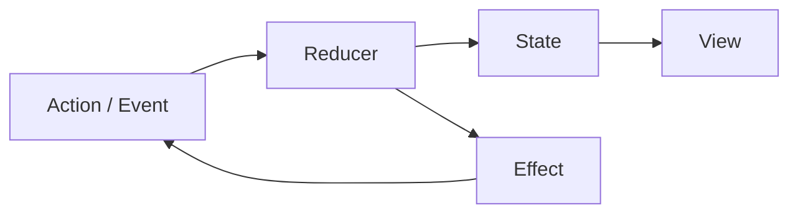

# TCA, Redux, BLoC — same river

> **Mental model.** One state tree (or one per feature), actions in, reducer out, effects on the side. Different national costumes.

## The picture

## How it actually works

**Redux** made the river famous on the web. RN still lives here (or in Redux Toolkit). The store is global unless you work not to.

**BLoC** is Redux with a stream per feature and a Dart type system. Cubit is BLoC with methods instead of event classes.

**TCA** (The Composable Architecture, iOS) is Redux with value types, reducers that compose, and effects as first-class data. If you know `bloc_test`, you already understand TCA tests.

**Riverpod** is not Redux. It is a dependency graph of providers. You can still put UDF *inside* a notifier.

<!-- pagebreak -->

| Dialect | Unit of state | Side effects | Best at |
| --- | --- | --- | --- |
| Redux | store slice | thunk / saga / listener | RN brownfield |
| BLoC | per-feature bloc | `repo` in handler | Flutter teams |
| Cubit | per-feature | methods | simple screens |
| TCA | composed reducers | `Effect` | SwiftUI + test logs |
| Riverpod | provider | notifier body | Flutter DI + state |

## You already know this in Flutter as…

Teaching TCA to yourself: rename `Event` → `Action`, `emit` → `state =`, `repository` call → `Effect.run`. Same river.

## Architect call

Do not run Redux *and* Bloc *and* Riverpod in one app without a written rule. Pick a river. Use DI (Riverpod / Hilt) beside it, not a second river.

## Anti-patterns

- Global Redux for a single form.
- Bloc that is 1,200 lines because the feature was never split.
- TCA copied onto Android by someone who wanted a blog post.

## War-room question

“Where does ‘open the receipt’ live — reducer, effect, or view?” (Effect / coordinator. Not the reducer.)

## Cheatsheet

- Same river: action → reducer → state + effect.
- BLoC / Redux / TCA are dialects.
- One river per app. DI is not a second river.
