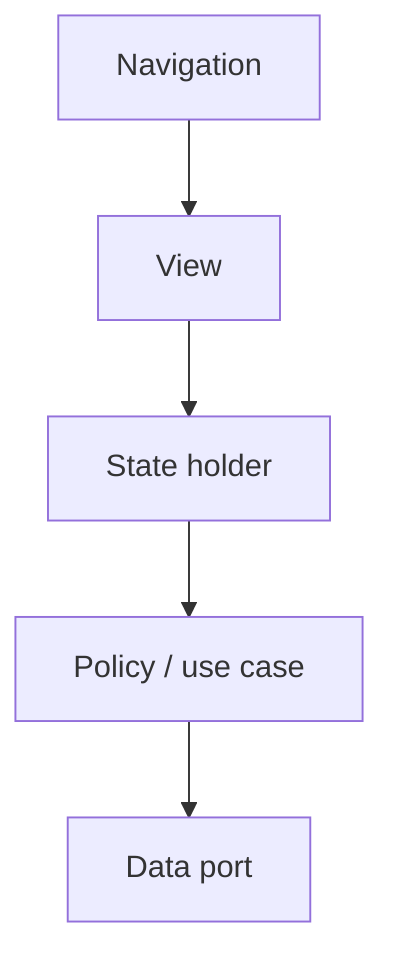

# Platform maps — what people actually ship

> **Mental model.** Marketing names lie. Map the *roles*: view, state holder, policy, data, navigation.

## The picture

Fill the boxes per stack. If a box is empty, that role leaked into a neighbor.

## How it actually works

**Android, done properly:** Compose (or Views) bind to a `ViewModel` that exposes UDF state. Use cases optional. Repository + DataStore/Room/Retrofit behind interfaces. Navigation Compose or a graph. Hilt at the edge.

**iOS:** SwiftUI + `@Observable` / `ObservableObject` is MVVM. UIKit + coordinators if the app is old. TCA if the team wants a river. URLSession behind a protocol.

**Flutter:** Widget + Bloc/Cubit/Notifier + repository. `go_router` as coordinator. Pure Dart domain if you paid for it.

<!-- pagebreak -->

**RN:** Function component + hooks. Server cache (React Query) is *not* UI state. Redux if the team is already there. Native modules behind a TS interface.

| Role | Android | iOS | Flutter | RN |
| --- | --- | --- | --- | --- |
| View | Compose | SwiftUI / UIKit | Widget | Component |
| State holder | ViewModel | Observable / TCA | Bloc / Notifier | useState / store |
| Policy | use case | struct / actor | class / function | function |
| Data | repository | repository | repository | repository / Query |
| Navigation | Nav graph | Coordinator | go_router | React Navigation |

## You already know this in Flutter as…

`flutter_bloc` + `go_router` + a repo package is a complete map. Android ViewModel is your Cubit. SwiftUI `View` is your widget. Stop translating syntax; translate *roles*.

## Architect call

In a mixed org, write this table on the wiki once. New hires fill it for their stack in week one.

## Anti-patterns

- “We use MVVM” on RN when they mean `useState` in a 400-line screen.
- React Query as the domain model for checkout rules.
- Two ViewModels for one screen because a tutorial said “one VM per widget.”

## War-room question

Hand a junior this table with the Flutter column filled. Can they fill iOS without Googling class names?

## Cheatsheet

- Roles, not brand names.
- View / state / policy / data / nav — five boxes.
- Empty box = leaked responsibility.
