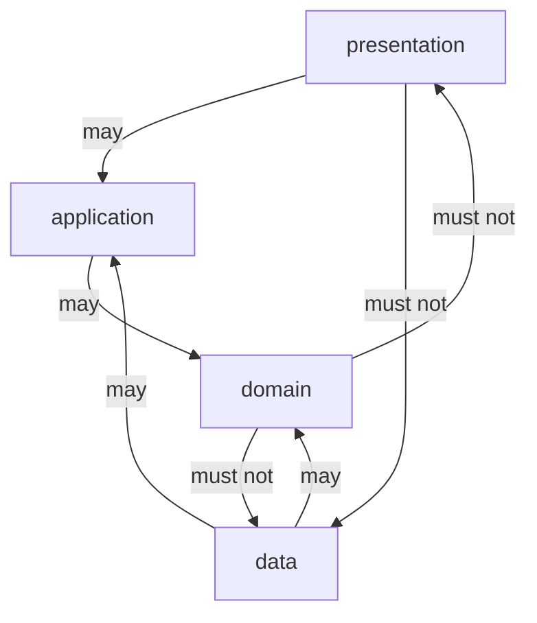

# Presentation, domain, data — who may import whom

> **Mental model.** An import is a dependency. A dependency is a promise you cannot break later.

## The picture

The last arrow is the one teams skip: screens importing Room / Dio / `shared_preferences`.

## How it actually works

**Presentation** may import application APIs and UI kits. It formats and dispatches.

**Application** (use cases) may import domain and ports. It orchestrates.

**Domain** imports nothing from the outside world. Types, math, rules.

**Data** implements ports. It may import SDKs. It maps to domain.

<!-- pagebreak -->

Lint what you cannot preach. Android: Gradle module APIs. Flutter: package `analysis_options` + no `flutter` in domain. iOS: SPM targets. RN: ESLint `no-restricted-imports`.

| Bad import | Why it hurts |
| --- | --- |
| Widget → DTO | JSON rename breaks UI |
| Domain → BuildContext | tests need a device |
| Use case → Retrofit | vendor swap edits policy |
| Data → Widget | you now have two UIs |

## You already know this in Flutter as…

`import 'package:flutter/material.dart'` in a “domain” file is the whole lesson.

## Architect call

Make the illegal import a CI failure, not a Slack opinion.

## Anti-patterns

- `core` that re-exports everything so imports look clean and direction dies.
- “Just this mapper in the widget, it is faster.”
- Domain enums that include `toJson`.

## War-room question

“Show me the CI rule that would have failed this PR.” If there isn’t one, the diagram is a poster.

## Cheatsheet

- Presentation ↛ data.
- Domain ↛ anyone.
- Lint the arrows.
