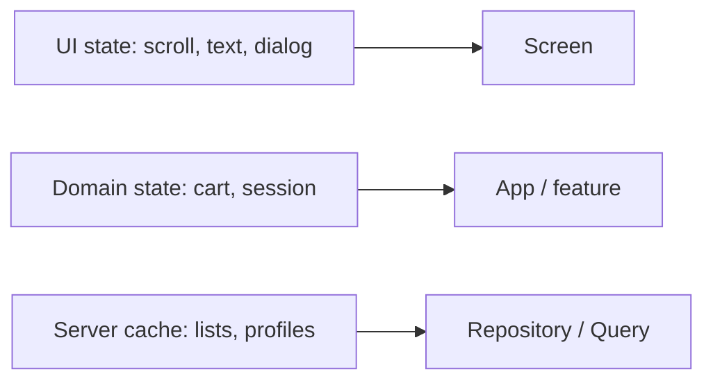

# Who owns which state

> **Mental model.** Three piles: pixels, business, and server cache. Mixing them is how you get “ghost” badges.

## The picture

## How it actually works

**UI state** dies with the screen (or survives configuration change if you care). Cursor position, “is the sheet open,” password visible.

**Domain state** is the product: cart lines, auth session, feature flags you already resolved. It outlives a screen.

**Server cache** is a *copy* of the backend with a freshness rule. React Query / a repository cache. It is not the cart’s source of truth if the user can edit the cart offline.

<!-- pagebreak -->

| Pile | Lives in | Do not put here |
| --- | --- | --- |
| UI | ViewModel ephemeral / `useState` / `StatefulWidget` | user id |
| Domain | session store, cart bloc | `isPasswordVisible` |
| Cache | repository, Query client | checkout legal rules |

## You already know this in Flutter as…

Hydrated Bloc for the cart: domain. `TextEditingController`: UI. `dio` cache: server. Three tools, three piles.

## Architect call

Write “source of truth” on the design. If two piles claim the same field, you will ship a race.

## Anti-patterns

- Putting the entire user profile in a global Provider because one avatar needed it.
- Treating React Query data as editable domain (mutate cache as if it were a cart).
- Saving scroll offset into the domain store.

## War-room question

“The user edits their name offline. Which pile is truth until sync, and who loses if the server disagrees?”

## Cheatsheet

- UI / domain / cache — three piles.
- One source of truth per field.
- Cache is a copy, not a policy.
