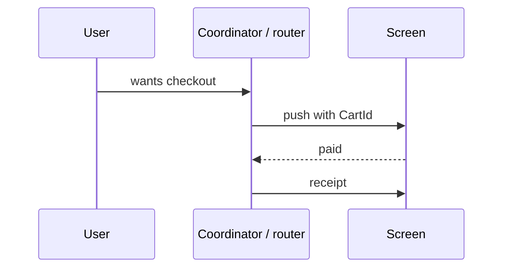

# Navigation is architecture

> **Mental model.** A route is a public API. Deep links are just that API with a URL.

## The picture

The screen reports *outcomes*. The coordinator chooses *destinations*.

## How it actually works

If a widget/controller knows the next route name, you have coupled two features. A coupon team cannot change the success screen without opening checkout.

**Typed routes** (`CartRoute(id)`), **graphs** (Android Navigation), **go_router**, **React Navigation** — all fine. The rule is the same: feature code emits *intents* (`CheckoutCompleted`), not `push('/magic')`.

Deep links, app links, universal links, notifications: they enter at the coordinator, not at a random widget `initState`.

<!-- pagebreak -->

| Stack | Coordinator-shaped tool |
| --- | --- |
| Android | Nav graph + ViewModel outcomes |
| iOS | Coordinator / TCA destination |
| Flutter | `go_router` / auto_route |
| RN | navigation container + linking config |

## You already know this in Flutter as…

`context.go` inside a Bloc is a smell (Bloc should not need `BuildContext`). Emit an effect; let a listener / router map it.

## Architect call

Own a single linking table. If marketing invents a new URL, one file changes.

## Anti-patterns

- Stringly routes (`'/user/' + id`) in twelve files.
- Notification payload that opens a screen by instantiating it, bypassing the graph.
- Back stack as a junk drawer (pushing login on top of checkout).

## War-room question

“A push notification arrives during an active payment. Who decides whether we interrupt, and with which API?”

## Cheatsheet

- Screens report outcomes. Routers pick destinations.
- Deep links enter at the coordinator.
- One linking table.
