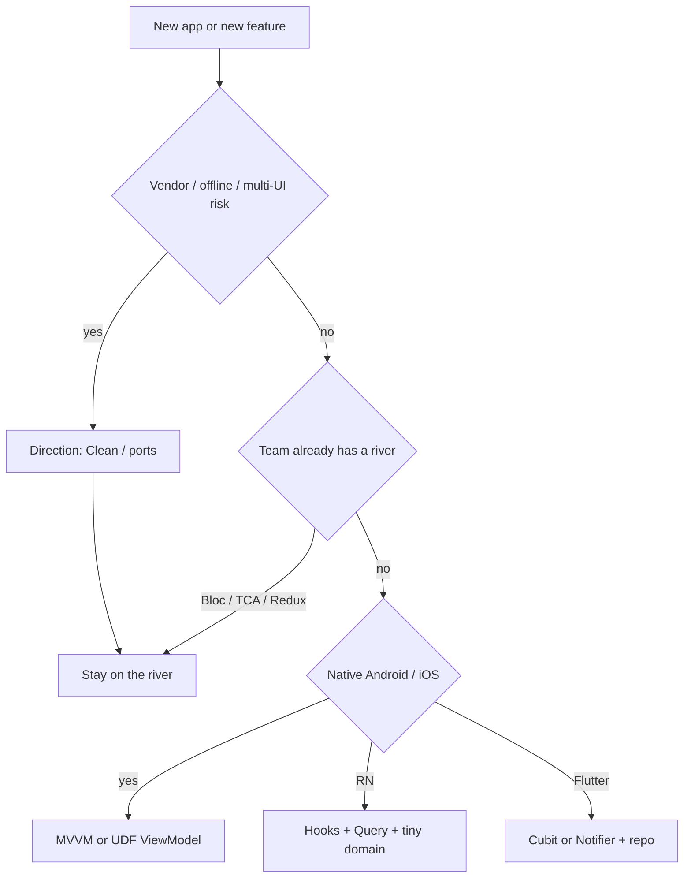

# Which pattern — a 60-second pick

> **Mental model.** Pick for the *team and the risk*, not for the blog you liked this month.

## The picture

## How it actually works

**Default, 2026:**

- Flutter: Cubit/Notifier + repository. Bloc when events are a product need. Clean *direction* if money or identity is involved.
- Android: ViewModel + UDF + repository. Hilt.
- iOS: SwiftUI MVVM. TCA if the team is already TCA. Coordinators for flows.
- RN: hooks + React Query for server cache + a real domain module when rules exist.

<!-- pagebreak -->

| Situation | Pick | Do not pick |
| --- | --- | --- |
| Three-screen marketing app | MVVM / Cubit | Full Clean + VIPER |
| Payments + offline | Ports + use cases | Widgets talking to Stripe |
| UIKit app with VIPER | Keep, wrap new SwiftUI | Big-bang rewrite |
| Mixed RN + native | JSI modules + clear JS domain | Second Redux |
| You are the only Flutter hire | Cubit, boring | TCA-in-Dart experiment |

## You already know this in Flutter as…

You have already chosen Bloc vs Riverpod once. The architect upgrade is choosing *again* for an iOS team you do not personally enjoy.

## Architect call

Write the pick in the RFC in one paragraph: team, risk, default, escape hatch. If you cannot, you are decorating.

## Anti-patterns

- Clean as a costume (folders, no seams).
- A new pattern per squad.
- Rewriting working MVP because MVVM is “modern.”

## War-room question

You have 60 seconds. The app is a field tool with bad radio and a two-person iOS team that knows UIKit. What do you pick, and what do you refuse?

## Cheatsheet

- Risk → direction (Clean). Team → dialect (Bloc/TCA/VM).
- Boring defaults beat clever uniques.
- One paragraph RFC. One escape hatch.
