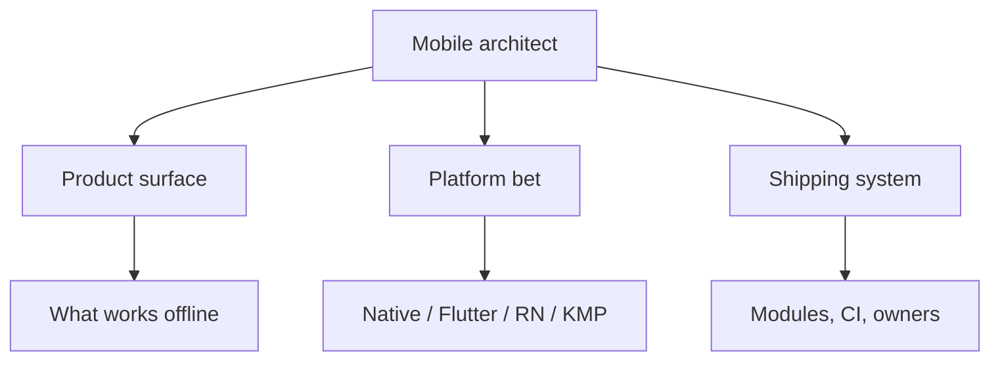

# What a mobile architect owns

> **Mental model.** You own the decisions that are expensive to reverse: product surface, platform bet, and how the org ships.

## The picture

You do not own every pixel. You own the *frame* those pixels live in.

## How it actually works

**Product surface** — can checkout survive a kill? Is the watch a real client or a remote? What is the contract with the backend (BFF vs public API)?

**Platform bet** — hiring, time-to-market, UX ceiling, brownfield. This is Volume 7 later. You still *name* it now.

**Shipping system** — who can release, how rollback works, what “done” means for crash-free and store review.

<!-- pagebreak -->

| Owns | Does not own |
| --- | --- |
| Dependency direction | Button corner radius (unless a11y) |
| Min OS / store story | Every feature flag name |
| Module boundaries | The copy on a toast |
| Quality bar (crash, startup) | Ticket estimation theatre |

## You already know this in Flutter as…

You already decide package boundaries and “add-to-app vs rewrite.” That *is* architect work. The title just makes you do it for iOS and RN too.

## Architect call

If a meeting is about a folder name with no reverse-cost, leave. If it is about “can we ever leave Firebase Auth,” stay.

## Anti-patterns

- Architect as “the person who draws circles and writes no code.”
- Architect as “the best pixel pusher.”
- Owning none of CI because “that is DevOps.”

## War-room question

“What did you decide last quarter that we could not undo this quarter?” If the list is empty, you were a senior IC with a nicer title.

## Cheatsheet

- Expensive-to-reverse = yours.
- Three rings: product, platform, org.
- Circles without shipping are posters.
