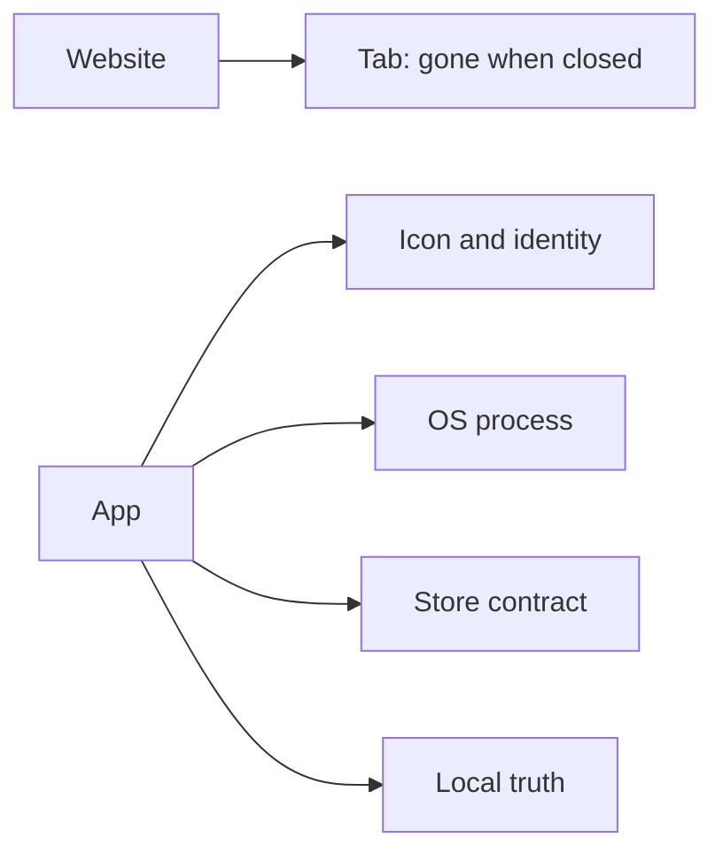

# The app is the product

> **Mental model.** A website is a tab. An app is a resident: process, icon, store, OS, and a user who thinks it is *theirs*.

## The picture

## How it actually works

People ask “why isn’t this just a website?” Answer with constraints, not tribalism:

- **Process** — the OS will kill you. You must resume.
- **Store** — Apple and Google are extra regulators. Privacy manifests, target SDK, payments rules.
- **Hardware** — camera, BLE, sensors, widgets, live activities, tiles.
- **Trust** — biometrics, keychain, attestation.
- **Attention** — push, badging, offline queues.

A BFF still matters. The app is not “the backend on the phone.” The app is the *product surface* that can work when the backend is sad.

<!-- pagebreak -->

| If the need is… | Maybe web | Need an app |
| --- | --- | --- |
| Read content, logged-out | Yes | Rarely |
| Payments + wallet + offline | Painful | Yes |
| Store-grade identity | Hard | Yes |
| OS widgets / share sheet | Limited | Yes |
| Weekly brochure | Yes | Vanity |

## You already know this in Flutter as…

Flutter web is a target, not a get-out-of-store-free card. If you need IAP and a camera pipeline, you already knew it was an app.

## Architect call

Write a one-pager: “we are an app because ___.” If the blanks are “the CEO wants an icon,” push back.

## Anti-patterns

- Wrapping a website in a webview and calling it a strategy.
- Ignoring store review as “release engineering.”
- Building a website’s information architecture into a phone with no offline story.

## War-room question

“Name three things this product does that a well-made PWA cannot, and one thing we should have left on the web.”

## Cheatsheet

- App = resident + store + OS + local truth.
- BFF is a friend. The phone is still the product.
- “Why not a website?” — answer with constraints.
