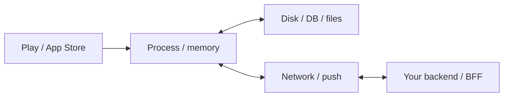

# The app is a distributed system

> **Mental model.** One user, many computers: the phone, the radio, your API, the store, and last night’s backup.

## The picture

You already design distributed systems if you have a queue, a cache, and a retry. The phone just lies about being “one device.”

## How it actually works

**Process** — ephemeral. Killed at any time. State in memory is a rumor.

**Disk** — durable until the user clears data, changes phones, or iCloud/Google fights you.

**Network** — optional. Partition is the normal case on a train.

**Store** — a deployment plane you do not fully control (review, staged rollout, last-good binary).

**Backend** — another team’s process. Versions drift. The app must speak *old and new*.

<!-- pagebreak -->

| Failure | Architect move |
| --- | --- |
| Process death | Persist intent, not just UI |
| Partition | Queue + truth rules |
| Store reject | Feature flags, not a binary bet |
| API drift | Versioned DTOs, tolerant readers |
| New phone | Account-based restore, not “the file was on disk” |

## You already know this in Flutter as…

`hydrated_bloc` + a repository queue is a mini distributed system. Treat it with the same respect you would give Kafka — just smaller.

## Architect call

Draw this five-box diagram in every kickoff. If a box has no owner, you will meet it in production.

## Anti-patterns

- “We’ll just refetch on every screen.”
- Believing `shared_preferences` is a backup plan.
- One binary that can only talk to today’s API.

## War-room question

“The user paid, the app died, the receipt push failed. Which box still knows the truth?”

## Cheatsheet

- Five boxes: process, disk, network, store, API.
- Memory is a rumor. Disk is local. Network is optional.
- Design for kill, partition, and version drift.
