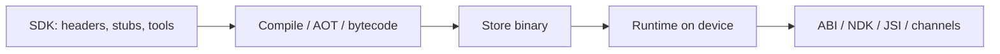

# Binary, runtime, SDK, ABI

> **Mental model.** Users install a **binary**. That binary talks to a **runtime**. You develop against an **SDK**. The **ABI** is the handshake you cannot casually break.

## The picture

## How it actually works

**SDK** — what you compile *against* (`compileSdk`, Xcode, Flutter SDK). You can target a newer SDK than the user’s OS if you stay within APIs you guard.

**Min OS / min SDK** — the oldest runtime you promise to run on. This is a product cut (who we abandon), not a Gradle trivia.

**Binary** — IPA / APK / AAB / on-disk Flutter. What review sees.

**Runtime** — ART, Darwin + Swift/ObjC runtime, Dart AOT/VM, Hermes.

**ABI** — application binary interface. JNI signatures, Swift module stability, Dart FFI, JSI host functions. Change it carelessly and plugins crash on old minors.

<!-- pagebreak -->

| Word | Android | iOS | Flutter | RN |
| --- | --- | --- | --- | --- |
| SDK | Android SDK / AGP | Xcode + SDK | Flutter SDK | RN + Android/iOS SDKs |
| Binary | APK / AAB | IPA | embeds both | embeds both |
| Runtime | ART | Darwin | Dart + engine | Hermes + native |
| ABI risk | JNI / 16 KB pages | modules / bitcode-era scars | FFI / engine | JSI / codegen |

**Package vs library:** a package is a distribution unit (`aar`, `xcframework`, `pub`, npm). A library is the code. Architects version *packages*.

## You already know this in Flutter as…

`pubspec` SDK constraints vs the engine that shipped in the binary. A plugin compiled for an old engine ABI is the crash in your crashlytics that says `UnsatisfiedLinkError` or a missing symbol.

## Architect call

Pin the story: min OS, target SDK, Flutter/RN version, NDK. Review it quarterly. This is architecture.

## Anti-patterns

- “Just bump compileSdk” without reading behavior changes.
- Shipping debug/JIT bits to the store.
- A plugin that vendors a second copy of the engine.

## War-room question

“If we drop Android 8, what *product* do we lose, and what *runtime* do we gain?”

## Cheatsheet

- SDK = compile against. Runtime = run on. Binary = what you ship.
- ABI is a contract with native code.
- Min OS is a product decision.
