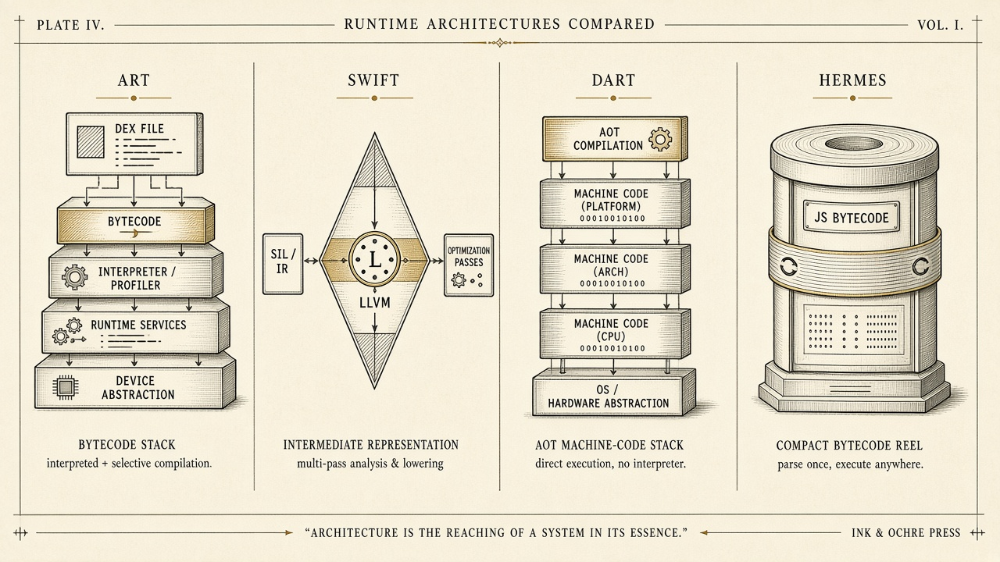
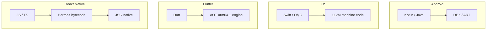

# Four runtimes — do not mix them up

> **Mental model.** ART, Swift/LLVM, Dart AOT, and Hermes are four different ways a phone runs your ideas.

## The picture

## How it actually works

**ART** — Android’s VM. Compiles DEX (profile-guided, now AOT-heavy). GC pauses are *your* jank if you allocate in a list scroll.

**Swift / LLVM** — mostly ahead-of-time native. ARC, not GC. The cost is retain cycles and the main actor, not a nursery scan.

**Dart** — debug is a VM (hot reload). Release on mobile is AOT machine code plus the Flutter engine (Impeller). Isolates do not share heap.

**Hermes** — a JS engine aimed at RN. Bytecode in the binary. The New Architecture talks to native through JSI, not a JSON bridge.

<!-- pagebreak -->

| Runtime | Heap | UI thread name | Crossing to native |
| --- | --- | --- | --- |
| ART | GC | Main looper | JNI |
| Swift | ARC | Main actor | direct / C |
| Dart | GC per isolate | UI isolate | channels / FFI |
| Hermes | GC | JS thread ≠ UI thread | JSI / TurboModules |

This is why “just run my Dart mental model on RN” fails. RN has *two* important threads before you even start. Flutter has a UI isolate and a raster thread in the engine.

## You already know this in Flutter as…

Hot reload is a *debug VM* luxury. The store binary is AOT. Never benchmark architecture in debug.

## Architect call

When someone says “JS is slow” or “Dart is slow,” ask *which runtime, which thread, which allocation*. The sentence is otherwise folklore.

## Anti-patterns

- Comparing Flutter debug to RN release.
- Treating JNI / channels / JSI as the same cost.
- Ignoring 16 KB page sizes / bitcode-era myths as “native trivia.”

## War-room question

Draw all four boxes from memory, including how each talks to native. You have two minutes.

## Cheatsheet

- ART = DEX/GC. Swift = LLVM/ARC. Dart = AOT + engine. Hermes = JS bytecode + JSI.
- Debug ≠ store.
- Crossing to native always has a price; the price differs.
