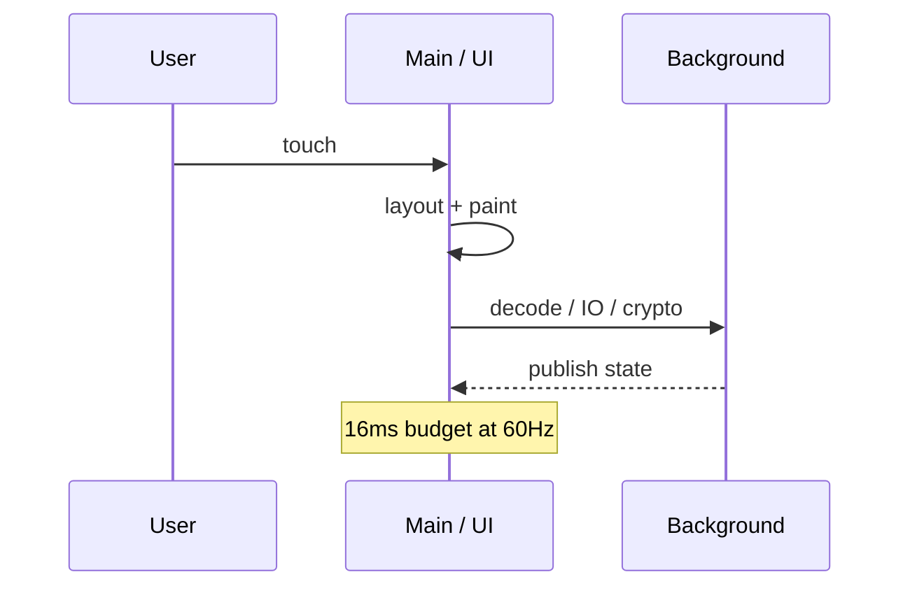

# The main thread is sacred

> **Mental model.** Pixels are produced on a privileged thread. If you stall it, the OS calls you frozen. Users call you junk.

## The picture

16 ms at 60 Hz. 8 ms at 120 Hz. That is the whole budget for input, layout, and draw.

## How it actually works

**Android** — main looper. `StrictMode`, jank traces, ANR at ~5 s of block. Work: coroutines on `Dispatchers.IO` / `Default`, then `StateFlow` back.

**iOS** — main actor. Hang detection. Work: `Task.detached` / background `URLSession`, hop back with `@MainActor`.

**Flutter** — UI isolate. `async` still runs *there* unless you `compute` / spawn. The engine has a raster thread you do not get to casually block either.

**RN** — JS thread *and* UI thread. A heavy JS reduce blocks JS; a heavy native view blocks UI. They are not the same.

<!-- pagebreak -->

| Allowed on main | Never on main |
| --- | --- |
| Bind state to views | Large JSON parse |
| Short animation ticks | Image decode of a camera still |
| Dispatching work | Encryption of a file |
| Drawing | Disk walks, DB migrations |

## You already know this in Flutter as…

`ListView.builder` vs a `map` of 2,000 widgets. Same religion, every platform.

## Architect call

Make “main-thread I/O” a CI-detectable crime where the platform allows (StrictMode, main-thread checker). The rest is review.

## Anti-patterns

- “It’s just one `readAsString` in `initState`.”
- RN: huge Redux reduce on JS during scroll.
- Flutter: `fromJson` of a catalog on the UI isolate at startup.

## War-room question

“Show me the trace where we dropped a frame, and which thread owned that stack.”

## Cheatsheet

- Main paints. Everything else is a guest.
- 16 ms / 8 ms.
- RN has two sacred threads. Flutter’s `async` is not an isolate.
