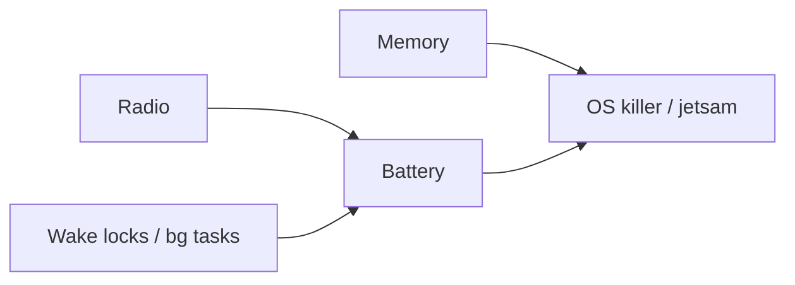

# Memory, battery, radio

> **Mental model.** The phone is a furnace with a small tank. Memory, watts, and radio are first-class budgets — not “perf later.”

## The picture

The OS will murder you (LMK, jetsam) before the user will thank you for a prettier cache.

## How it actually works

**Memory** — bitmaps, lists, WebViews, Flutter images. Leak a listener and you leak a screen. On iOS, a retain cycle is a leak. On Android/Dart/JS, a forgotten subscription is a leak.

**Battery** — CPU, GPU, GPS, radio. A 1 Hz timer that hits the network is a product bug. Background limits exist because of architects who ignored this.

**Radio** — the most expensive thing you casually do. Batch. Coalesce. Cache. HTTP/2 and a BFF beat 40 tiny REST calls from a list row.

<!-- pagebreak -->

| Budget | Android | iOS | Flutter | RN |
| --- | --- | --- | --- | --- |
| Memory | LMK, profiler | jetsam | image cache + isolates | Hermes heap + native |
| Battery | Battery Historian | Instruments | timeline + native | same + JS wakeups |
| Radio | WorkManager batch | BGTasks / URLSession | same plugins | same native |

## You already know this in Flutter as…

`cached_network_image` without a bound is a memory policy. A `Timer.periodic` in a discarded widget is a battery policy.

## Architect call

Put numbers in the RFC: target RSS, startup, and “network calls per cold home.” If you cannot name them, you cannot defend them.

## Anti-patterns

- Wake lock “just until this finishes” that never finishes.
- Prefetching the world on 5% battery and poor radio.
- Holding bitmaps at screen × 3 “for sharpness.”

## War-room question

“We will add live location for the whole session. What is the battery story, and who turns it off?”

## Cheatsheet

- Memory / watts / radio are architecture.
- Batch the radio. Bound the cache. Drop the timer.
- OS killers are the real QA.
