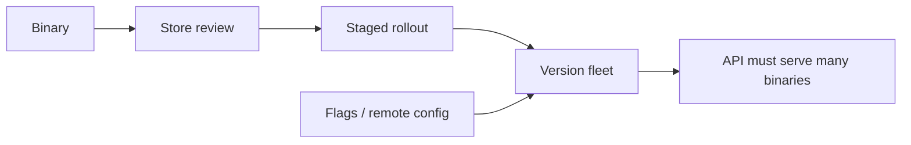

# Stores and versioning are architecture

> **Mental model.** You do not deploy to devices. You *propose* a binary to two regulators, then to a percentage of users who may never update.

## The picture

## How it actually works

**Min OS / target SDK** — Google and Apple force target bumps. Behavior changes hitchhike on those bumps. Read them like you read a breaking API.

**Review** — privacy nutrition labels, privacy manifests, Photo/ATT, payments. A feature that cannot pass review is not a feature.

**Fleet** — N versions live at once. Your backend and your feature flags must tolerate last quarter’s binary.

**Rollback** — stores let you halt a rollout. They do not let you edit yesterday’s binary. Flags are the real rollback.

<!-- pagebreak -->

| Lever | Use it for | Not for |
| --- | --- | --- |
| Staged rollout | Crash watch | Hiding an unfinished legal flow |
| Feature flag | Kill / experiment | Shipping secret APIs in the binary forever |
| Force update | Broken security | Taste |
| Min OS bump | Runtime / API you need | “Cleaner CI” |

## You already know this in Flutter as…

You already wait for store review after `flutter build`. Treat `minSdk` and iOS deployment target as product, same as a pub constraint.

## Architect call

Never ship a one-way schema (local DB or API) without a reader that understands the previous version. The fleet is the customer.

## Anti-patterns

- “Everyone updates in a week.” They do not.
- Killing a flag server-side while the old binary still *requires* that endpoint shape.
- Force-update as a substitute for QA.

## War-room question

“If 12% of users stay on last release for six months, which of today’s changes murder them?”

## Cheatsheet

- Review + fleet + flags = the real deploy.
- APIs serve many binaries.
- Min OS is a product cut.
- Rollback is a flag, not a prayer.

You can now explain the architect job, the four runtimes, the sacred main thread, and why the store is part of the system. Say **write volume 2** when you want mobile OS internals next.
